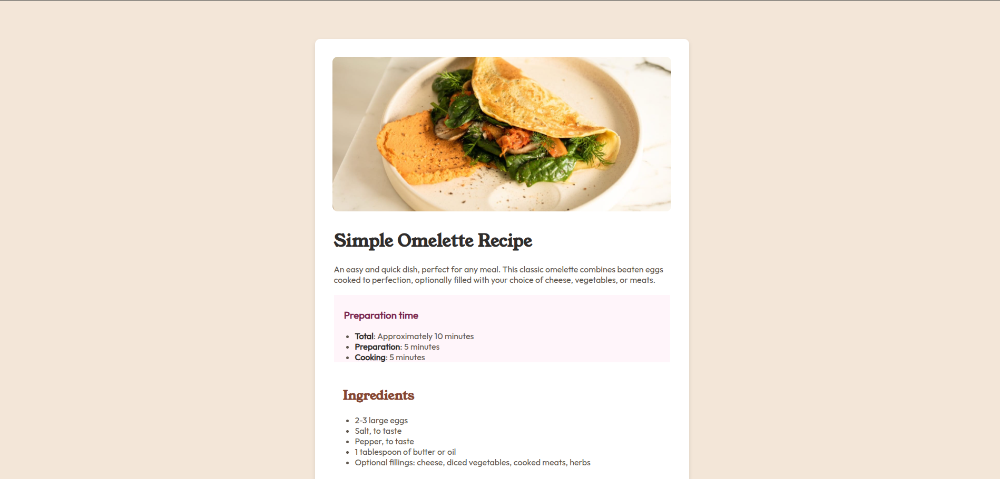

# Recipe Page - README



## Overview
This project is a responsive recipe page for a delicious omelette recipe. The page features a clean, modern design with a focus on typography and visual hierarchy. The layout is fully responsive and adapts to different screen sizes.

## Features
- **Modern Design**: Clean layout with a recipe card that stands out
- **Responsive Layout**: Works on mobile, tablet, and desktop screens
- **Typography**: Custom fonts from Google Fonts (Young Serif and Outfit)
- **Interactive Elements**: Hover effects on the recipe card
- **Structured Content**: Organized sections for preparation time, ingredients, instructions, and nutrition
- **Visual Separation**: Subtle dividers between sections

## Technologies Used
- HTML5
- CSS3
- Google Fonts (Young Serif and Outfit)

## File Structure
```
recipe-page/
├── assets/
│   ├── images/
│   │   ├── favicon-32x32.png
│   │   └── image-omelette.jpeg
│   └── fonts/
│       ├── young-serif/
│       │   └── YoungSerif-Regular.ttf
│       └── outfit/
│           └── Outfit-VariableFont_wght.ttf
├── index.html
├── style.css
└── README.md
```

## How to Use
1. Clone the repository:
```bash
git clone https://github.com/your-username/recipe-page.git
```

2. Open the project folder:
```bash
cd recipe-page
```

3. Open `index.html` in your browser

## Customization
You can customize the recipe by modifying:
- The HTML content in `index.html`
- The styling in `style.css`
- The fonts in the `assets/fonts` directory
- The images in the `assets/images` directory

## Live Demo
[View the live demo here](https://your-username.github.io/recipe-page/)

## Credits
- Design inspiration from Frontend Mentor
- Fonts from Google Fonts
- Recipe content from traditional omelette recipes

## License
This project is licensed under the MIT License - see the [LICENSE.md](LICENSE.md) file for details.
